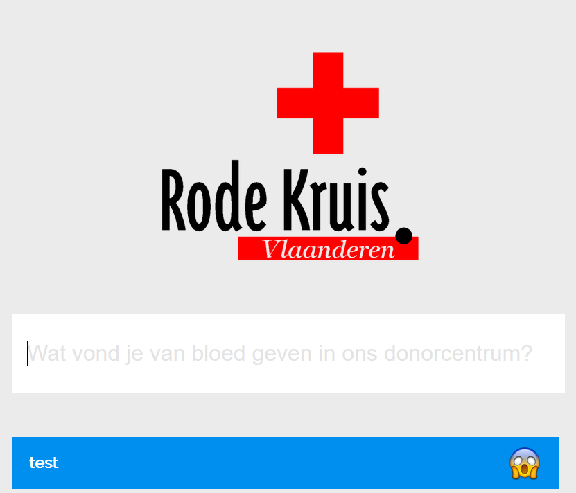

# MessageBoard

We will go through an exercise in which we deploy a message board on Firebase. Functionality of this board can then be further extended using Cloud Functions, Google Cloud Pub/Sub, ...

**Attendees of this workshop will start their own project and copy parts of this repo in theirs or use it in case of trouble to get the solution.**

The presenter is available for all questions. But it's best to think a couple minutes about the problem before calling the hotline :)

## Step 0 - Setting up your environment
In order to start, make sure the following is setup:
* Install Git
  * https://git-scm.com/downloads
* Clone this repository:
```
git clone https://github.com/Lukkie/technovate-cloud-messageboard.git
```
* You have a working Google Cloud subscription (use the $300 free allowance to get started without any costs).
  [Click here](https://console.cloud.google.com) to get to the Google Cloud Platform (GCP).
  * **The account has been provided to you by AE for the duration of the Technovate.**
* Make sure [npm](https://www.npmjs.com/get-npm) is setup. The exact way you install npm depends on the OS you're using.
* Download the Angular CLI to create your own project that we will deploy to Firebase.
  ```bash
  npm install -g @angular/cli
  ```
* Download Firebase tools to interact with Firebase, the main product we will be working with today.
  ```bash
  npm install -g firebase-tools
  ```

## Step 1a - Deploying the project
This is not a course on Angular, but we need a project to deploy to Firebase. Follow these steps to do your first deploy.
* Create a new Angular project with the name "message-board". Make sure to create this project on a location that is different from the git repository you checked out.
  ```bash
  ng new
  ```
  * Use `SCSS` for styling.
  * After this command is finished, change line 20 of `angular.json` to setup `dist` as the output directory of the build process, instead of `dist/message-board`.
* Initialize firebase in your Angular project
  ```bash
  firebase init
  ```
  * Initialize `Database`, `Functions` and `Hosting`.
  * Use the defaults for all choices, except:
    * Use `TypeScript` for functions.
    * Use `dist` as the public directory.
* Uncomment the hello world function in `functions/src/index.ts`. This function responds to a request by returning `"Hello from Firebase!"`.
  ```js
    export const helloWorld = functions.https.onRequest((request, response) => {
        response.send("Hello from Firebase!");
    });
  ```
* Deploy your application to Firebase!
  ```bash
  firebase deploy
  ```

When you go to your application url (see deploy output), you will see "Firebase Hosting Setup Complete".

This corresponds with index.html in your `dist` directory. This is the public directory and is "served" by firebase. We will build the Angular project in this directory so that it's hosted by Firebase. This is why we needed to change the output directory earlier.

* Build the Angular project and redeploy to Firebase.
  ```bash
  ng build
  firebase deploy
  ```

  When you now go to your application url, you should see the following UI:

  

  If you're still seeing the same UI as before, make sure to clear your cache, or disable caching in the Developer Tools (under the Network tab).

* The functions have also been deployed. The URL for your HelloWorld function is also displayed in the deploy notes. Try opening it in your web browser!

* Additional information (not part of this workshop but may be useful):
  * All URLs can also be found by navigating to the Firebase console: https://console.firebase.google.com
  * If you don't like having to execute `firebase deploy` whenever you want to push a change, or when you want to separate your website from your functions, you can try to deploy your site on Heroku or Netlify. Both have integrations with GitHub and will automatically update your website when the GitHub repository changes. You could even introduce some kind of CI (e.g. CircleCI) so that the `ng build` step is also automatically executed.


## Step 1b - Add the Message board to the application
Now we're going to add the Message board front-end to our application. Since this is not a course on Angular, we don't go into detail and you can just copy the right files from this project to your project.

* Copy the following files/directories from this git repo to your own project:
  * `package.json`
  * `src/`
* Download the dependencies using `npm`.
  ```bash
  npm install
  ```

Now all files are in place, we still need to configure one thing: the connection between the Front End we're creating and the Firebase Back End. Take a look at `src/environments/environment.ts`. You see we need to configure some properties so your angular application knows how it can connect to Firebase.
* Find out where you can find these variables on Firebase and configure them in `src/environments/enviornment.ts`.
  * Hint: Go to the Firebase's web console.
* Build and deploy your application to Firebase.
  ```bash
  ng build
  firebase deploy
  ```
If all went well, when you now go to your application url, you should see the Message board.


Try adding messages on the board. You'll see them appear, but the sentiment will remain blue, since we haven't configured anything yet. If you refresh the page, the message will disappear. Let's get down to business and get to the real work in the next steps.

## Step 2 - Sentiment analysis
Now, let's add sentiment analysis to our application.

We'll add 2 cloud functions:
* `translateMessageToEnglish`:
  Translate messages from all languages to English using a Google managed service.
  The web app creates messages in the Firestore on the path 'messages/{messageId}'.
  Make a function that:
  * is triggered by this creation event,
  * translates the message using Google Cloud Translation library,
  * update the Firestore message with the translation in the field "en"
  * and returns false (Convention for Google Cloud Functions)
* `checkMessageSentiment`:
  Check the sentiment of an English message using a Google managed service.
  The first function updated the message with an English translation on field "en".
  Make a function that:
  * is triggered by this update event,
  * retrieves a sentiment score between -1 and 1 from a Google Cloud Language service,  
  * update the Firestore message with the sentiment in the field "score"
  * and returns false (Convention for Google Cloud Functions)


Messages are stored in the following way in FireStore:
```js
export interface Message {
  descr: string;
  date: string;
  en?: string; // English translation
  score?: number; // Sentiment score
}
```
When you write to the FireStore, do it following this interface in order for everything to work properly.

Developing the functions on your own would probably not fit in this workshop. **The finished code for this functions is available in the Git repo in the functions directory.** Make sure to overwrite the whole directory and adapt the project ID in `index.ts`.

**You'll still need to enable the APIs for both the translation service and the language service in the Google Cloud console:**
https://console.cloud.google.com

* In the template, we already added npm packages for both APIs that serve as a proxy to the google services. We use those instead of calling the APIs directly.
  * Install these packages by going to the `functions` directory and running `npm install`.
* Something JavaScript specify. Promises in JavaScript need to handle unlucky paths (exceptions). TSLint will fail if you don't handle them. In this demo, we just catch the error and log it to the console. **Don't do this in a real production environment! Always properly handle your exceptions.**
* The [Firebase Console](https://console.firebase.google.com) provides a UI to see the logs of your cloud functions. Your cloud function obviously needs to be deployed on Firebase.
* You can also only deploy functions using the following command. This will be much faster than deploying the entire project.
  ```bash
  firebase deploy --only functions
  ```

If all went well, when you now go to your application url and enter text, you should see emojis on the Message board.

